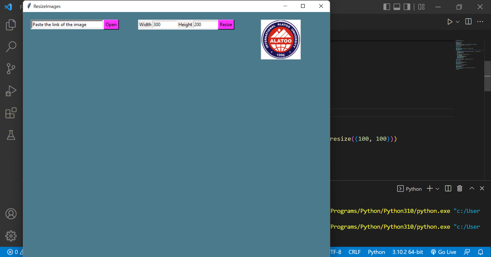
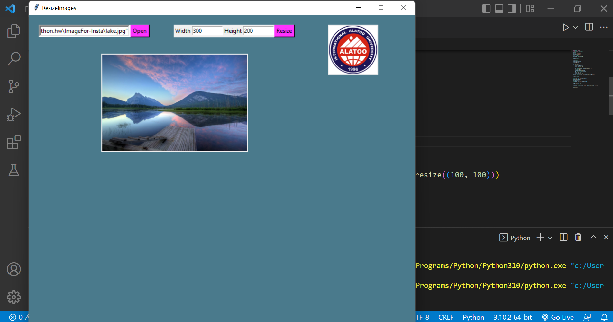
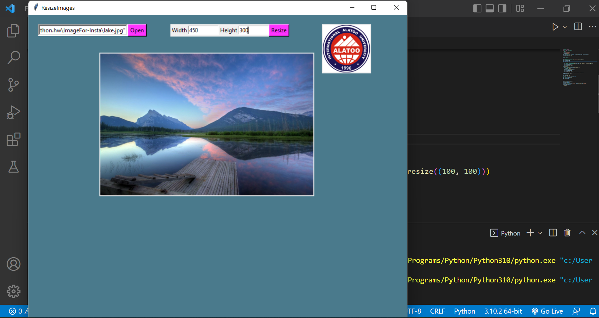

# Resizing images 

### This python code is written to resize an image.

### First, you should copy the link of the image and paste in thу specified field.

### Then, you should open it by clicking the button "Open" (don't worry, if you put quotes, you don't need to remove them, the code removes them automatically).

### Finally, you can specify the width and height of your image, then click on the button "Resize".

